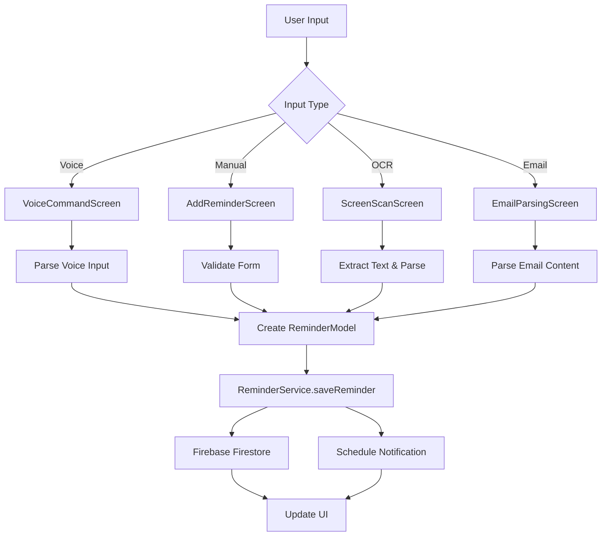
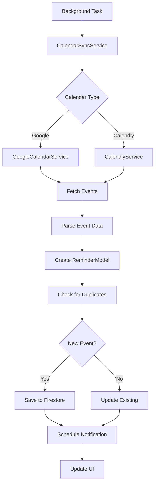

# Reminder Plus - Technical Documentation

## 🔧 Implementation Details & API Reference

This document provides detailed technical information about the Reminder Plus application, including implementation specifics, API references, and architectural decisions.

## 📋 Table of Contents

- [Core Architecture](#core-architecture)
- [Service Layer Implementation](#service-layer-implementation)
- [Data Flow Patterns](#data-flow-patterns)
- [API Integration Details](#api-integration-details)
- [Background Processing](#background-processing)
- [State Management](#state-management)
- [Error Handling](#error-handling)
- [Performance Optimizations](#performance-optimizations)
- [Security Implementation](#security-implementation)

## 🏗️ Core Architecture

### Design Patterns Used

#### 1. Service Layer Pattern
**Purpose**: Centralize business logic and data operations

**Implementation**:
```dart
// Base service structure
abstract class BaseService {
  static final FirebaseFirestore _firestore = FirebaseFirestore.instance;
  static final FirebaseAuth _auth = FirebaseAuth.instance;
  
  // Common error handling
  static Future<T> handleServiceCall<T>(Future<T> Function() operation) async {
    try {
      return await operation();
    } catch (e) {
      print('Service error: $e');
      rethrow;
    }
  }
}
```

#### 2. Repository Pattern
**Purpose**: Abstract data access layer

**Implementation**:
```dart
class ReminderRepository {
  static Future<String?> saveReminder(ReminderModel reminder) async {
    return await BaseService.handleServiceCall(() async {
      final docRef = await _firestore.collection('reminders').add(reminder.toMap());
      await _scheduleNotification(reminder);
      return docRef.id;
    });
  }
}
```

#### 3. Factory Pattern
**Purpose**: Create service instances based on configuration

**Implementation**:
```dart
class ServiceFactory {
  static CalendarService createCalendarService(String type) {
    switch (type) {
      case 'google':
        return GoogleCalendarService();
      case 'calendly':
        return CalendlyService();
      default:
        throw UnsupportedError('Unknown calendar type: $type');
    }
  }
}
```

### Dependency Injection

**Current Implementation**: Manual dependency injection
**Future Enhancement**: Consider using GetIt or Provider for more sophisticated DI

```dart
// Manual DI example
class ScreenScanScreen extends StatefulWidget {
  @override
  State<ScreenScanScreen> createState() => _ScreenScanScreenState();
}

class _ScreenScanScreenState extends State<ScreenScanScreen> {
  final ImagePicker _picker = ImagePicker();
  final GoogleCalendarService _googleService = GoogleCalendarService();
  final CalendlyService _calendlyService = CalendlyService();
}
```

## 🔧 Service Layer Implementation

### FirebaseService

**Purpose**: Centralized Firebase operations

**Key Methods**:

#### User Management
```dart
static Future<DocumentSnapshot?> getUserProfile() async {
  final user = _auth.currentUser;
  if (user == null) return null;
  
  return await _firestore
      .collection('users')
      .doc(user.uid)
      .get();
}

static Future<void> updateUserProfile(Map<String, dynamic> data) async {
  final user = _auth.currentUser;
  if (user == null) throw Exception('User not authenticated');
  
  await _firestore
      .collection('users')
      .doc(user.uid)
      .update(data);
}
```

#### Reminder Operations
```dart
static Future<List<ReminderModel>> getUserReminders() async {
  final user = _auth.currentUser;
  if (user == null) return [];
  
  final snapshot = await _firestore
      .collection('reminders')
      .where('createdBy', isEqualTo: user.uid)
      .orderBy('dateTime')
      .get();
  
  return snapshot.docs
      .map((doc) => ReminderModel.fromMap(doc.data(), doc.id))
      .toList();
}
```

### ReminderService

**Purpose**: Reminder business logic and CRUD operations

**Core Methods**:

#### Save Reminder
```dart
static Future<String?> saveReminder(ReminderModel reminder) async {
  try {
    final user = _auth.currentUser;
    if (user == null) throw Exception('User not authenticated');

    // Add user context
    final reminderWithUser = reminder.copyWith(
      createdBy: user.uid,
      createdAt: DateTime.now(),
      updatedAt: DateTime.now(),
    );

    // Save to Firestore
    final docRef = await _firestore
        .collection('reminders')
        .add(reminderWithUser.toMap());
    
    // Schedule notification
    await _scheduleNotification(reminderWithUser.copyWith(id: docRef.id));
    
    return docRef.id;
  } catch (e) {
    print('Error saving reminder: $e');
    return null;
  }
}
```

#### Voice Input Parsing
```dart
static ReminderModel? parseVoiceInput(String text) {
  // Date patterns
  final datePatterns = [
    RegExp(r'(\d{1,2})/(\d{1,2})/(\d{4})'),
    RegExp(r'(\d{1,2})-(\d{1,2})-(\d{4})'),
    RegExp(r'(today|tomorrow)', caseSensitive: false),
  ];
  
  // Time patterns
  final timePatterns = [
    RegExp(r'(\d{1,2}):(\d{2})\s*(am|pm)', caseSensitive: false),
    RegExp(r'(\d{1,2})\s*(am|pm)', caseSensitive: false),
  ];
  
  // Parse logic...
  return parsedReminder;
}
```

### NotificationService

**Purpose**: Local notification management

**Initialization**:
```dart
static Future<void> initialize() async {
  const androidSettings = AndroidInitializationSettings('@mipmap/ic_launcher');
  const iosSettings = DarwinInitializationSettings(
    requestAlertPermission: true,
    requestBadgePermission: true,
    requestSoundPermission: true,
  );
  
  const initSettings = InitializationSettings(
    android: androidSettings,
    iOS: iosSettings,
  );
  
  await _notifications.initialize(initSettings);
  await _requestPermissions();
}
```

**Scheduling**:
```dart
static Future<void> scheduleReminder({
  required int id,
  required String title,
  required String body,
  required DateTime scheduledTime,
  String? customSound,
}) async {
  final androidDetails = AndroidNotificationDetails(
    'reminder_channel',
    'Reminders',
    importance: Importance.max,
    priority: Priority.high,
    sound: customSound != null 
        ? RawResourceAndroidNotificationSound(customSound.split('.').first)
        : null,
  );
  
  final iosDetails = DarwinNotificationDetails(
    sound: customSound ?? 'default',
  );
  
  final details = NotificationDetails(
    android: androidDetails,
    iOS: iosDetails,
  );
  
  await _notifications.zonedSchedule(
    id,
    title,
    body,
    _convertToTZDateTime(scheduledTime),
    details,
    uiLocalNotificationDateInterpretation: 
        UILocalNotificationDateInterpretation.absoluteTime,
  );
}
```

## 📊 Data Flow Patterns

### Reminder Creation Flow



### Calendar Sync Flow



## 🔌 API Integration Details

### Google Calendar API

**Authentication Flow**:
```dart
class GoogleCalendarService {
  final GoogleSignIn _googleSignIn = GoogleSignIn(
    scopes: [
      'email',
      'https://www.googleapis.com/auth/calendar.readonly',
      'https://www.googleapis.com/auth/calendar.events',
    ],
  );
  
  Future<bool> signIn() async {
    try {
      final GoogleSignInAccount? googleUser = await _googleSignIn.signIn();
      if (googleUser == null) return false;
      
      final GoogleSignInAuthentication googleAuth = 
          await googleUser.authentication;
      
      _authClient = authenticatedClient(
        http.Client(),
        AccessCredentials(
          AccessToken('Bearer', googleAuth.accessToken!, 
              DateTime.now().add(Duration(hours: 1))),
          googleAuth.idToken,
          _scopes,
        ),
      );
      
      _calendarApi = CalendarApi(_authClient!);
      return true;
    } catch (e) {
      print('Google Sign-In error: $e');
      return false;
    }
  }
}
```

**Event Fetching**:
```dart
Future<List<ReminderModel>> fetchEvents() async {
  if (_calendarApi == null) return [];
  
  try {
    final events = await _calendarApi!.events.list(
      'primary',
      timeMin: DateTime.now().toUtc(),
      maxResults: 100,
      singleEvents: true,
      orderBy: 'startTime',
    );
    
    return events.items?.map((event) {
      return ReminderModel(
        title: event.summary ?? 'Untitled Event',
        dateTime: event.start?.dateTime?.toLocal() ?? DateTime.now(),
        repeat: 'No Repeat',
        snooze: '5 Min',
        createdBy: FirebaseAuth.instance.currentUser!.uid,
        source: 'google',
        externalId: event.id,
        metadata: {
          'location': event.location,
          'description': event.description,
          'organizer': event.organizer?.email,
          'attendees': event.attendees?.map((a) => a.email).toList(),
        },
        createdAt: DateTime.now(),
        updatedAt: DateTime.now(),
      );
    }).toList() ?? [];
  } catch (e) {
    print('Error fetching Google Calendar events: $e');
    return [];
  }
}
```

### Calendly API

**Authentication**:
```dart
class CalendlyService {
  String? _accessToken;
  final String _baseUrl = 'https://api.calendly.com';
  
  Future<bool> connect(String token) async {
    try {
      // Validate token
      final response = await http.get(
        Uri.parse('$_baseUrl/users/me'),
        headers: {
          'Authorization': 'Bearer $token',
          'Content-Type': 'application/json',
        },
      );
      
      if (response.statusCode == 200) {
        _accessToken = token;
        return true;
      }
      return false;
    } catch (e) {
      print('Calendly connection error: $e');
      return false;
    }
  }
}
```

**Event Fetching**:
```dart
Future<List<ReminderModel>> fetchEvents() async {
  if (_accessToken == null) return [];
  
  try {
    final response = await http.get(
      Uri.parse('$_baseUrl/scheduled_events?status=active&min_start_time=${DateTime.now().toIso8601String()}'),
      headers: {
        'Authorization': 'Bearer $_accessToken',
        'Content-Type': 'application/json',
      },
    );
    
    if (response.statusCode == 200) {
      final data = json.decode(response.body);
      final List<ReminderModel> reminders = [];
      
      for (var eventData in data['collection']) {
        // Fetch detailed event information
        final eventUri = eventData['uri'];
        final eventResponse = await http.get(
          Uri.parse(eventUri),
          headers: {
            'Authorization': 'Bearer $_accessToken',
            'Content-Type': 'application/json',
          },
        );
        
        if (eventResponse.statusCode == 200) {
          final eventDetails = json.decode(eventResponse.body)['resource'];
          final reminder = ReminderModel(
            title: eventDetails['name'] ?? 'Calendly Event',
            dateTime: DateTime.parse(eventDetails['start_time']).toLocal(),
            repeat: 'No Repeat',
            snooze: '5 Min',
            createdBy: FirebaseAuth.instance.currentUser!.uid,
            source: 'calendly',
            externalId: eventDetails['uri'],
            metadata: {
              'meeting_type': eventDetails['event_type'],
              'invitee': eventDetails['invitees']?.isNotEmpty == true 
                  ? eventDetails['invitees'][0] : null,
            },
            createdAt: DateTime.now(),
            updatedAt: DateTime.now(),
          );
          reminders.add(reminder);
        }
      }
      return reminders;
    }
    return [];
  } catch (e) {
    print('Error fetching Calendly events: $e');
    return [];
  }
}
```

## ⚙️ Background Processing

### Android WorkManager

**Task Definition**:
```dart
class BackgroundTaskService {
  static Future<void> initialize() async {
    await Workmanager.initialize(callbackDispatcher);
    await _registerPeriodicTask();
  }
  
  static Future<void> _registerPeriodicTask() async {
    await Workmanager.registerPeriodicTask(
      "reminder_check",
      "checkDueReminders",
      frequency: Duration(minutes: 15),
      constraints: Constraints(
        networkType: NetworkType.connected,
        requiresBatteryNotLow: true,
      ),
    );
  }
}
```

**Task Execution**:
```dart
static void callbackDispatcher() {
  Workmanager().executeTask((task, inputData) async {
    switch (task) {
      case "checkDueReminders":
        await _checkDueReminders();
        break;
      case "syncCalendars":
        await _syncCalendars();
        break;
    }
    return Future.value(true);
  });
}

static Future<void> _checkDueReminders() async {
  try {
    final reminders = await ReminderService.getDueReminders();
    for (final reminder in reminders) {
      await NotificationService.showNotification(
        id: reminder.id?.hashCode ?? DateTime.now().millisecondsSinceEpoch,
        title: 'Reminder: ${reminder.title}',
        body: 'Time for your reminder!',
      );
    }
  } catch (e) {
    print('Background task error: $e');
  }
}
```

### iOS BackgroundTasks

**Configuration**:
```dart
class BackgroundTaskService {
  static Future<void> initialize() async {
    await BackgroundFetch.configure(
      BackgroundFetchConfig(
        minimumFetchInterval: 15, // minutes
        stopOnTerminate: false,
        enableHeadless: true,
        requiresStorageNotLow: false,
        requiresCharging: false,
        requiresDeviceIdle: false,
        requiredNetworkType: NetworkType.ANY,
      ),
      _onBackgroundFetch,
    );
  }
  
  static Future<void> _onBackgroundFetch(String taskId) async {
    print('Background fetch started: $taskId');
    
    try {
      await _checkDueReminders();
      await _syncCalendars();
    } catch (e) {
      print('Background fetch error: $e');
    }
    
    BackgroundFetch.finish(taskId);
  }
}
```

## 🔄 State Management

### Current Implementation: Provider Pattern

**Settings Provider**:
```dart
class SettingsProvider extends ChangeNotifier {
  SettingsModel? _settings;
  bool _isLoading = false;
  
  SettingsModel? get settings => _settings;
  bool get isLoading => _isLoading;
  
  Future<void> loadSettings() async {
    _isLoading = true;
    notifyListeners();
    
    try {
      _settings = await SettingsService.getSettings();
    } catch (e) {
      print('Error loading settings: $e');
    } finally {
      _isLoading = false;
      notifyListeners();
    }
  }
  
  Future<void> updateSettings(SettingsModel newSettings) async {
    try {
      await SettingsService.updateSettings(newSettings);
      _settings = newSettings;
      notifyListeners();
    } catch (e) {
      print('Error updating settings: $e');
    }
  }
}
```

**Usage in Widgets**:
```dart
class SettingsScreen extends StatelessWidget {
  @override
  Widget build(BuildContext context) {
    return Consumer<SettingsProvider>(
      builder: (context, settingsProvider, child) {
        if (settingsProvider.isLoading) {
          return CircularProgressIndicator();
        }
        
        final settings = settingsProvider.settings;
        if (settings == null) {
          return Text('No settings found');
        }
        
        return _buildSettingsUI(settings);
      },
    );
  }
}
```

## 🚨 Error Handling

### Global Error Handler

```dart
class ErrorHandler {
  static void initialize() {
    FlutterError.onError = (FlutterErrorDetails details) {
      FlutterError.presentError(details);
      _logError(details.exception, details.stack);
    };
    
    PlatformDispatcher.instance.onError = (error, stack) {
      _logError(error, stack);
      return true;
    };
  }
  
  static void _logError(dynamic error, StackTrace? stack) {
    print('Error: $error');
    print('Stack: $stack');
    
    // Log to Firebase Crashlytics or other service
    // FirebaseCrashlytics.instance.recordError(error, stack);
  }
}
```

### Service-Level Error Handling

```dart
class ReminderService {
  static Future<String?> saveReminder(ReminderModel reminder) async {
    try {
      // Implementation
      return await _performSave(reminder);
    } on FirebaseException catch (e) {
      print('Firebase error: ${e.code} - ${e.message}');
      throw ReminderException('Database error: ${e.message}');
    } on NetworkException catch (e) {
      print('Network error: ${e.message}');
      throw ReminderException('Network error: ${e.message}');
    } catch (e) {
      print('Unexpected error: $e');
      throw ReminderException('Unexpected error occurred');
    }
  }
}
```

### Custom Exception Classes

```dart
class ReminderException implements Exception {
  final String message;
  final String? code;
  
  ReminderException(this.message, [this.code]);
  
  @override
  String toString() => 'ReminderException: $message';
}

class NetworkException implements Exception {
  final String message;
  NetworkException(this.message);
  
  @override
  String toString() => 'NetworkException: $message';
}
```

## ⚡ Performance Optimizations

### Image Processing

```dart
class ImageProcessor {
  static Future<File> optimizeImage(File imageFile) async {
    final image = await decodeImageFromList(await imageFile.readAsBytes());
    
    // Resize if too large
    if (image.width > 1920 || image.height > 1080) {
      final resizedImage = await _resizeImage(image, 1920, 1080);
      return await _saveImage(resizedImage);
    }
    
    return imageFile;
  }
  
  static Future<ui.Image> _resizeImage(ui.Image image, int maxWidth, int maxHeight) async {
    final ratio = math.min(maxWidth / image.width, maxHeight / image.height);
    final newWidth = (image.width * ratio).round();
    final newHeight = (image.height * ratio).round();
    
    final recorder = ui.PictureRecorder();
    final canvas = Canvas(recorder);
    
    canvas.drawImageRect(
      image,
      Rect.fromLTWH(0, 0, image.width.toDouble(), image.height.toDouble()),
      Rect.fromLTWH(0, 0, newWidth.toDouble(), newHeight.toDouble()),
      Paint(),
    );
    
    final picture = recorder.endRecording();
    return await picture.toImage(newWidth, newHeight);
  }
}
```

### Caching Strategy

```dart
class CacheManager {
  static final Map<String, dynamic> _cache = {};
  static const Duration _cacheExpiry = Duration(minutes: 5);
  
  static T? get<T>(String key) {
    final cached = _cache[key];
    if (cached == null) return null;
    
    final cacheData = cached as Map<String, dynamic>;
    final expiry = cacheData['expiry'] as DateTime;
    
    if (DateTime.now().isAfter(expiry)) {
      _cache.remove(key);
      return null;
    }
    
    return cacheData['data'] as T;
  }
  
  static void set<T>(String key, T data) {
    _cache[key] = {
      'data': data,
      'expiry': DateTime.now().add(_cacheExpiry),
    };
  }
}
```

### Lazy Loading

```dart
class LazyReminderList extends StatefulWidget {
  @override
  State<LazyReminderList> createState() => _LazyReminderListState();
}

class _LazyReminderListState extends State<LazyReminderList> {
  final ScrollController _scrollController = ScrollController();
  List<ReminderModel> _reminders = [];
  bool _isLoading = false;
  int _currentPage = 0;
  static const int _pageSize = 20;
  
  @override
  void initState() {
    super.initState();
    _scrollController.addListener(_onScroll);
    _loadReminders();
  }
  
  void _onScroll() {
    if (_scrollController.position.pixels >= 
        _scrollController.position.maxScrollExtent * 0.8) {
      _loadMoreReminders();
    }
  }
  
  Future<void> _loadMoreReminders() async {
    if (_isLoading) return;
    
    setState(() => _isLoading = true);
    
    try {
      final newReminders = await ReminderService.getReminders(
        page: _currentPage + 1,
        pageSize: _pageSize,
      );
      
      setState(() {
        _reminders.addAll(newReminders);
        _currentPage++;
        _isLoading = false;
      });
    } catch (e) {
      setState(() => _isLoading = false);
    }
  }
}
```

## 🔒 Security Implementation

### Data Encryption

```dart
class EncryptionService {
  static const String _key = 'your-32-character-secret-key';
  
  static String encrypt(String plainText) {
    final key = Key.fromBase64(_key);
    final iv = IV.fromSecureRandom(16);
    final encrypter = Encrypter(AES(key));
    final encrypted = encrypter.encrypt(plainText, iv: iv);
    return '${iv.base64}:${encrypted.base64}';
  }
  
  static String decrypt(String encryptedText) {
    final parts = encryptedText.split(':');
    final iv = IV.fromBase64(parts[0]);
    final encrypted = Encrypted.fromBase64(parts[1]);
    final key = Key.fromBase64(_key);
    final encrypter = Encrypter(AES(key));
    return encrypter.decrypt(encrypted, iv: iv);
  }
}
```

### Secure Storage

```dart
class SecureStorageService {
  static const _storage = FlutterSecureStorage(
    aOptions: AndroidOptions(
      encryptedSharedPreferences: true,
    ),
    iOptions: IOSOptions(
      accessibility: KeychainAccessibility.first_unlock_this_device,
    ),
  );
  
  static Future<void> storeToken(String key, String token) async {
    await _storage.write(key: key, value: token);
  }
  
  static Future<String?> getToken(String key) async {
    return await _storage.read(key: key);
  }
  
  static Future<void> deleteToken(String key) async {
    await _storage.delete(key: key);
  }
}
```

### API Security

```dart
class ApiSecurityService {
  static Map<String, String> _getSecureHeaders() {
    return {
      'Content-Type': 'application/json',
      'Accept': 'application/json',
      'User-Agent': 'ReminderPlus/1.0.0',
    };
  }
  
  static Future<http.Response> secureGet(String url, {Map<String, String>? headers}) async {
    final secureHeaders = _getSecureHeaders();
    if (headers != null) secureHeaders.addAll(headers);
    
    return await http.get(
      Uri.parse(url),
      headers: secureHeaders,
    );
  }
  
  static Future<http.Response> securePost(String url, {Object? body, Map<String, String>? headers}) async {
    final secureHeaders = _getSecureHeaders();
    if (headers != null) secureHeaders.addAll(headers);
    
    return await http.post(
      Uri.parse(url),
      headers: secureHeaders,
      body: body != null ? json.encode(body) : null,
    );
  }
}
```

## 📊 Monitoring & Analytics

### Performance Monitoring

```dart
class PerformanceMonitor {
  static void trackScreenTime(String screenName, Duration duration) {
    // Track screen usage time
    print('Screen $screenName: ${duration.inMilliseconds}ms');
  }
  
  static void trackApiCall(String endpoint, Duration duration, bool success) {
    // Track API performance
    print('API $endpoint: ${duration.inMilliseconds}ms, Success: $success');
  }
  
  static void trackUserAction(String action, Map<String, dynamic> properties) {
    // Track user interactions
    print('Action: $action, Properties: $properties');
  }
}
```

### Error Tracking

```dart
class ErrorTracker {
  static void trackError(String error, StackTrace? stack, {Map<String, dynamic>? context}) {
    // Log error with context
    print('Error: $error');
    print('Stack: $stack');
    print('Context: $context');
    
    // Send to external service
    // FirebaseCrashlytics.instance.recordError(error, stack);
  }
  
  static void trackNonFatalError(String error, {Map<String, dynamic>? context}) {
    // Track non-fatal errors
    print('Non-fatal error: $error');
    print('Context: $context');
  }
}
```

---

This technical documentation provides a comprehensive overview of the Reminder Plus application's implementation details. For additional information or specific implementation questions, refer to the source code or create an issue in the repository.
